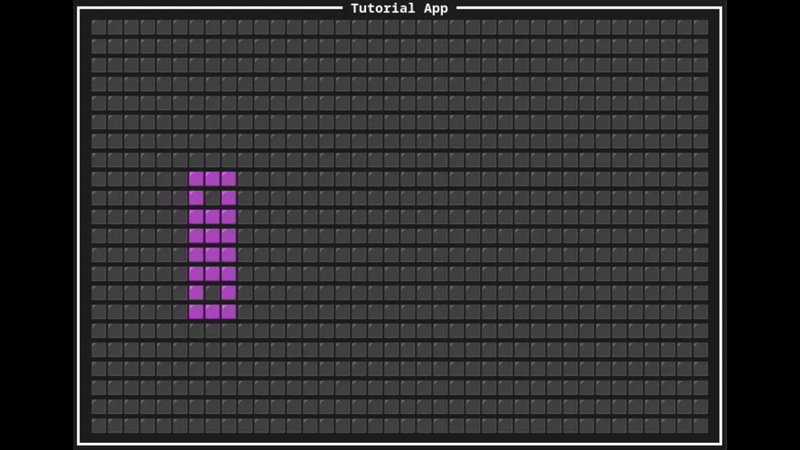
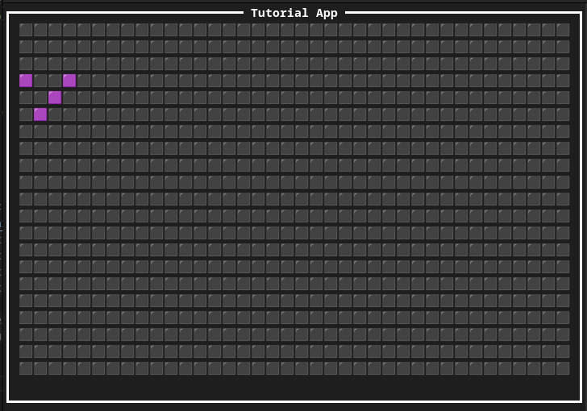
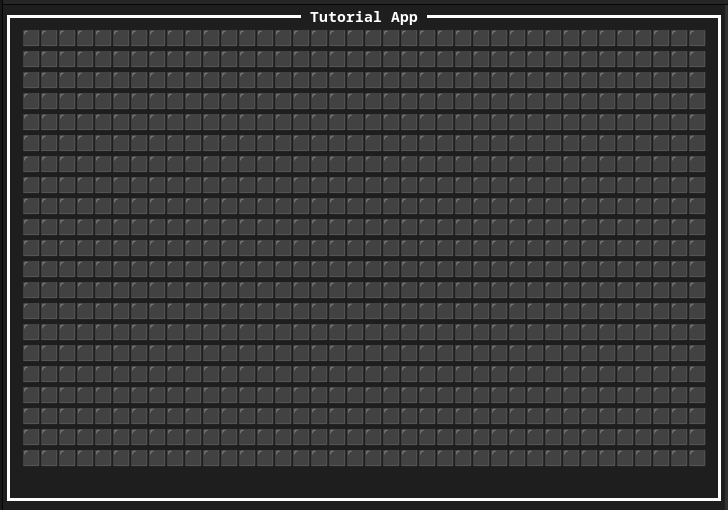

## Life-rs
A simple implementation of Conway's Game of Life made to explore CLI drawing with Ratatui.

The game board can be created with variable size, and is toroidal (opposing edges are connected).

Press "a" to advance to the next generation, and "q" to quit.

## Progress
(sorted by latest to oldest)

A working demo of the pentadecathlon pattern:

A game board with a few live pieces:

A blank game board:
